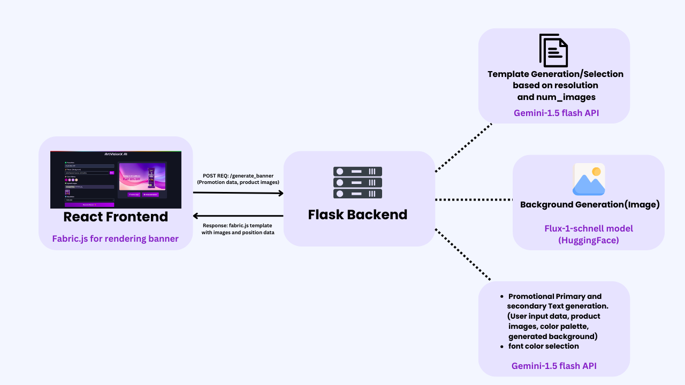

## How this works:

This Flask app dynamically generates image banners based on user-provided themes, color palettes, and target resolutions. It leverages a large language model (LLM), specifically Gemini, and potentially an image generation model (possibly Flux).  Here's a detailed breakdown of its system design:

1. **Template Management:**
    - The app uses a predefined set of `TEMPLATES` (a list of dictionaries). Each template specifies object placements (text and images) for different resolutions and image counts.  These act as layout blueprints.
    - The `select_template` function retrieves a matching template based on the requested resolution and number of images. If no exact match is found, it likely defaults to a template or generates one.
    - The `round_percentages` function helps refine the selected template by rounding percentage-based dimensions to the nearest integer.

2. **LLM-powered Template Generation:**
    - If a suitable template isn't found, `generate_template_with_gemini` dynamically creates one using structured prompt to the Gemini API.
    - It uses few-shot prompting, providing examples of input (resolution, image count) and desired JSON output (template structure).
    - The LLM generates a JSON template, which is then parsed using `parse_gemini_response`. This function likely handles JSON formatting and error handling.

3. **Background Image Generation:**
    - The `generate_background` function handles background creation.
    - It takes the theme, color palette, canvas width, and height as input.
    - It constructs a prompt for the image generation model Flux-1-schnell.
    - The image generation model is called with the prompt and other parameters.
    - The generated background image is returned.

4. **Gemini API Integration:**
    - The `generate_banner` function utilizes the Gemini API to generate textual and color information for the banner design.
    - It constructs a prompt that includes the generated template from step 2, the promotion details, theme, resolution, the base64 encoded background image from step 3, and the base64 encoded product images from the input.
    - The Gemini API response, which is expected to be in JSON format, contains descriptions for the background image, a list of hex color values present in the background image, a comma-separated list of product names, the main promotional text, optional secondary text, and hex color values for both main and secondary text.
    - Robust error handling (e.g., `try-except` blocks) is implemented to manage potential issues with the API response or JSON parsing.  The function likely checks for valid JSON structure and handles cases where the API call fails or returns unexpected data.
    - The extracted textual and color information from the Gemini API response is then used to finalize the banner design, integrating it with the background and product images.  This likely involves using image manipulation libraries (like Pillow) to overlay text onto the image.

5. **Image Encoding:**
    - The `image_to_base64` function converts the generated background image into a base64 encoded string. This is a common practice for embedding images directly into HTML or JSON responses.

This design allows for flexible banner creation, adapting to various resolutions and image counts. The use of an LLM for template generation adds a layer of automation and adaptability, reducing the need for manually defined templates.  The image generation component (Flux or similar) provides the visual content based on user-provided themes and colors.
